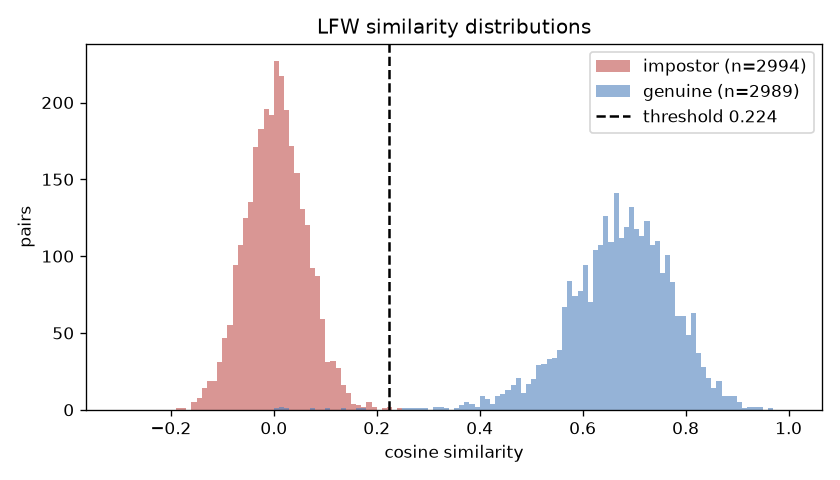
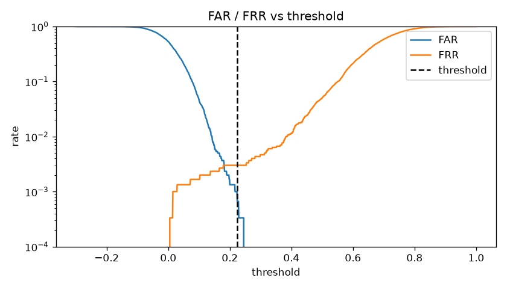
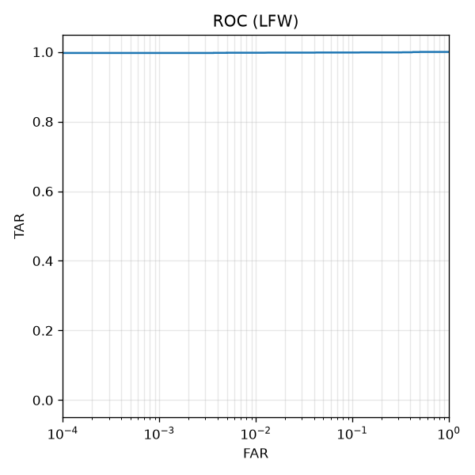

# Recognition threshold calibration: recognition-calibration-20260924T203410Z

- Date: 2026-09-24T20:34:14.588799+00:00
- Model: arcface_w600k_r50 (version 4c06341c33c2, dim 512, preprocessing arcface-5pt-umeyama-112-v1)
- Dataset: LFW (lfw.tgz, pairs.txt: 10 folds x 300 genuine + 300 impostor)
- Pairs used: 2989 genuine, 2994 impostor (skipped 17; images without a detected face: 11)

| metric | value |
|---|---|
| threshold | 0.2237 |
| far_at_threshold | 0.0007 |
| frr_at_threshold | 0.0030 |
| tar_at_threshold | 0.9970 |
| eer | 0.0030 |
| eer_threshold | 0.1815 |
| best_accuracy | 0.9985 |
| best_accuracy_threshold | 0.2537 |
| cv_10fold_mean_far | 0.0010 |
| cv_10fold_mean_frr | 0.0030 |
| cv_10fold_threshold_std | 0.0031 |
| genuine_pairs | 2989 |
| impostor_pairs | 2994 |
| pairs_skipped | 17 |
| images_without_face | 11 |
| genuine_mean | 0.6728 |
| genuine_std | 0.1037 |
| impostor_mean | 0.0041 |
| impostor_std | 0.0577 |
| impostor_max | 0.2454 |
| genuine_min | 0.0044 |

Selection rule: smallest threshold with FAR <= 0.001 on all impostor pairs.

10-fold cross-validation (threshold chosen on 9 folds, measured on the held-out fold):

| fold | threshold | FAR | FRR |
|---|---|---|---|
| 0 | 0.2237 | 0.0000 | 0.0067 |
| 1 | 0.2237 | 0.0000 | 0.0000 |
| 2 | 0.2237 | 0.0000 | 0.0000 |
| 3 | 0.2237 | 0.0000 | 0.0034 |
| 4 | 0.2237 | 0.0000 | 0.0100 |
| 5 | 0.2169 | 0.0033 | 0.0000 |
| 6 | 0.2237 | 0.0000 | 0.0067 |
| 7 | 0.2169 | 0.0033 | 0.0000 |
| 8 | 0.2237 | 0.0000 | 0.0033 |
| 9 | 0.2169 | 0.0033 | 0.0000 |

Limitation: with 3000 impostor pairs, FAR can only be resolved to about 3.3e-4, and LFW photos are not webcam frames. Treat this threshold as a starting point.